#  :iphone: Programación Multimedia y Dispositivos Móviles 2023/2024

## :books: UD02 - Programación en Android: Introducción y entorno de desarrollo

 
 

**OBJETIVOS DE LA UNIDAD:**

  1. **Conocer las características de Android.**
  2. **Estudiar la arquitectura interna de Android.**
  3. **Enumerar las principales versiones de Android y aprender a elegir la más idónea para desarrollar nuestras aplicaciones.**
  4. **Aprender a instalar y trabajar con el entorno de desarrollo (Android SDK).**  
  5. **Crear una primera aplicación y estudiar su estructura de un proyecto en Android.**  
  6. **Aprender a utilizar las herramientas disponibles para detectar errores en el código.**

 

**CARACTERISTÍCAS ANDROID:**

- Lenguajes de programación: Java y Kotlin.

- Uso de XML para el diseño de interfaces.

- Gran cantidad de servicios incorporados. (GPS, redes, bases de datos, síntesis de voz, navagador, multimedia, etc..).

- Amplia cuota de mercado.

    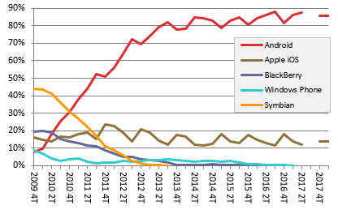

- Elementos principales:

  - Entorno integrado de desarrollo (Android Studio).

  - Android Software Development Kit (SDK): Incluye librerías y herramientas propias de desarrollo y depuración.

  - Android Platform Tools: Herramientas para poder compilar y generar paquetes (apk) para el sistema operativo Android.

  - La imagen del sistema operativo Android.

 

**ARQUITECTURA DE ANDROID:**
 
 

    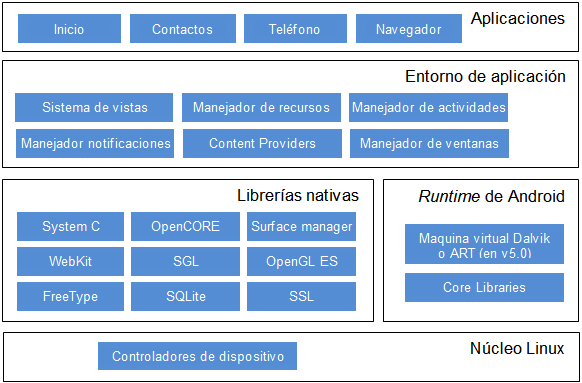

 

- **Núcleo Linux:** Proporciona servicios como la seguridad, el manejo de la memoria, el multiproceso, la pila de protocolos y el soporte de drivers para dispositivos.

- **Runtime Android:**  Basado en el concepto de máquina virtual utilizado en Java. Dadas las limitaciones de los dispositivos donde ha de correr Android (poca memoria y procesador limitado), no fue posible utilizar una máquina virtual Java estándar. Google tomó la decisión de crear una nueva, la máquina virtual ART, que respondiera mejor a estas limitaciones.

- **Librerias Nativas:** Conjunto de librerías en C/C++ usadas en varios componentes de Android. Están compiladas en código nativo del procesador. Muchas de ellas de código abierto.

- **Entorno de aplicación:** Plataforma de desarrollo libre para aplicaciones con gran riqueza e innovaciones (sensores, localización, servicios, barra de notificaciones, etc.).

- **Aplicaciones**: Conjunto de aplicaciones instaladas en una máquina Android. Todas las aplicaciones han de correr en la máquina virtual Dalvik para garantizar la seguridad del sistema. Normalmente las aplicaciones Android están escritas en Java o Kotlin. Para desarrollar este tipo de aplicaiones podemos utilizar el Android SDK. Existe otra opción consistente en desarrollar las aplicaciones utilizando C/C++. Para esta opción podemos utilizar el Android NDK (Native Development Kit).

- [Información más detallada sobre la arquitectura de Android](https://developer.android.com/guide/platform?hl=es-419)
 
 

**VERSIONES DE ANDROID:**

    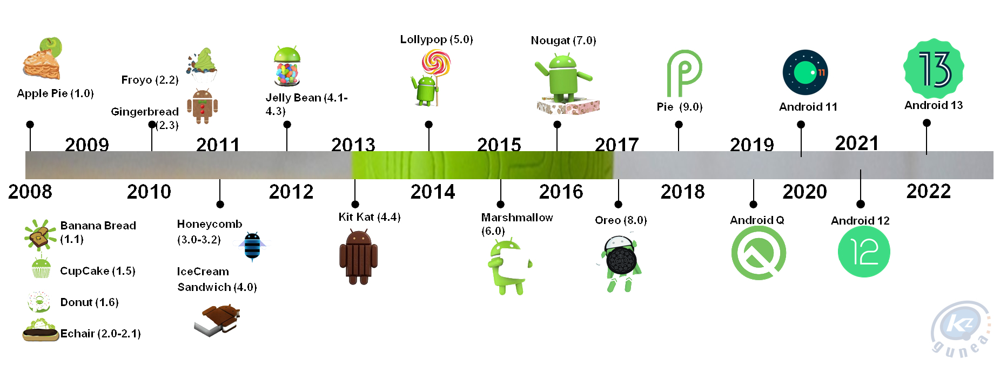

 - [Versiones de Android.](https://developer.android.com/about/versions?hl=es-419)

 - [Más información sobre el historial de versiones de Android.](https://es.wikipedia.org/wiki/Anexo:Historial_de_versiones_de_Android)

 - [Fragmentación en el mercado de las distintas versiones de Android.](https://www.statista.com/statistics/921152/mobile-android-version-share-worldwide/)

 

**VERSION MINIMA VS VERSION RECOMENDADA.**

  Antes de empezar a programar en Android, tendremos que seleccionar la versión del sistema que deseamos usar en la aplicación. Es muy importante observar que hay clases y métodos que están disponibles a partir de una versión; si las vamos a usar, hemos de conocer la versión mínima necesaria.

  Cuando se ha lanzado una nueva versión, siempre es compatible con las anteriores. Es decir, las nuevas versiones solo añaden nuevas funcionalidades, y en caso de modificar alguna funcionalidad, no se elimina, sino que se marcaa como obsoleta (deprecated), pero se puede continuar utilizando.

  A la hora de seleccionar la versión, tendremos que consultar si necesitamos alguna característica especial que solo esté disponible a partir de una versión concreta.

  Al crear la aplicación en Android Studio, ya nos muestra un gráfico de compatibilidad de las versiones cuando estamos seleccionando la versión mínima que queremos en nuestro proyecto.

 

**ANDROID STUDIO:**

- Entorno de desarrollo integrado oficial para la plataforma Android. Fue  anunciado el 16 de mayo de 2013 en la conferencia Google I/O, y reemplazó a Eclipse como el IDE  oficial para el desarrollo de aplicaciones para Android.

- IDE más recomendado y está basado en el IDE de Java Idea Intellij, permite una instalación  muy rápida de diferentes plugins. Además, nos permite la compilación y  exportación de APK.

- Integración con el emulador.

- Editor de código inteligente con autocompletado y control de versiones de código integrado.

- [Web Android Studio.](https://developer.android.com/studio)

    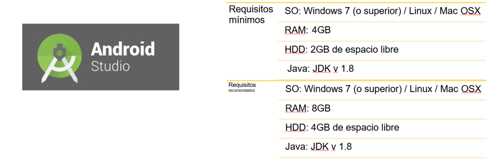

 

**DESCARGAR E INSTALACION DE ANDROID STUDIO:**

1. [Descarga e instala el Java Development Kit (JDK)](https://www.oracle.com/es/java/technologies/downloads/#jdk20-windows).
2. [Descarga Android Studio.](https://developer.android.com/studio/)
  - [Versiones anteriores de Android Studio](https://developer.android.com/studio/archive?hl=es-419).
3. [Como instalar Android Studio](https://developer.android.com/studio/install?hl=es-419).
4. [Introducción a Android Studio](https://developer.android.com/studio/intro?hl=es-419).        
5. [Configurar IDE para equipos con memoria insuficiente.](https://developer.android.com/studio/intro/studio-config?hl=es-419#low_memory)

 

**ENTORNO ANDROID STUDIO:**

    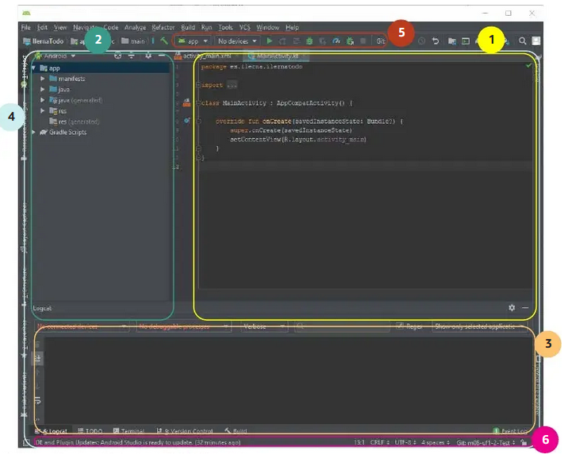

- 1- Editor de código: en esta sección podremos escribir y modificar el código de los diferentes archivos que componen la aplicación. Esta sección puede cambiar dependiendo del tipo de archivo que editemos.
- 2 y 3 - Ventanas de herramientas: cambian en función de la herramienta que hemos seleccionado, en ellas podemos encontrar la administración del proyecto.
- 4 - Barra de ventana de herramientas: permite expandir o contraer las ventanas de herramientas que podemos ver en las secciones 2 y 3.
- 5 - Herramientas de compilación y ejecución de la aplicación Android: en esta barra podemos ver en qué dispositivo ejecutamos la aplicación.
- 6 - Barra de estado: nos mostrará los mensajes de información y advertencias que se muestran en los diferentes procesos que ejecuta el IDE.

<h5>Tipos de vistas en Android Studio</h5>
 

- **Vista de Android**: Vista simplificada de la jerarquía de los ficheros del proyecto.

    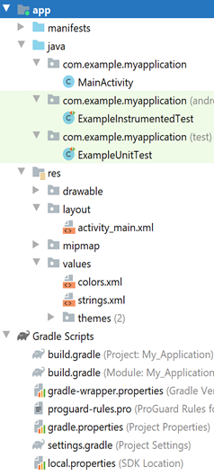

- **Vista de Proyecto**: Mayor detalle de la jerarquía completa de las carpetas y archivos que compone el proyecto.
 

    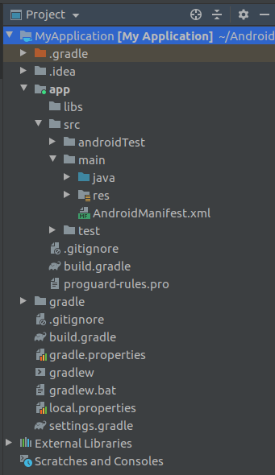

<h5>Proyecto Android Studio </h5>
 
 Un proyecto en Android Studio puede contener varios módulos. Cada módulo corresponde a una aplicación o ejecutable diferente. Disponer de varios módulos en un mismo proyecto nos será muy útil cuando queramos crear varias versiones de nuestra aplicación, para dispositivo móvil, Wear, TV, Things, etc. También si queremos crear varias versiones de nuestra aplicación con nivel mínimo de SDK diferentes.

 
 
 Los módulos nos permiten crear bibliotecas de código que se comparten en otros módulos del proyecto o incluso con otros proyectos.
 

<h5>Archivos y carpetas de un proyecto Android</h5>
 

    

- <b>manifests</b>: AndroidManifest.xml, define la configuración y otros aspectos de la aplicación que estamos creando y qué componentes incluye, así como los permisos necesarios que utilizará.

- <b>java</b>: Contiene todo el código de nuestra aplicación Java/Kotlin, organizado en paquetes. Incluye también los tests unitarios de las distintas clases.    
  - <b>MainActivity</b>: Clase con el código de la actividad inicial.

  - <b>ExampleInstrumentTest</b>: Clase pensada para insertar código de testeo de la aplicación.

  - <b>ExampleUnitTest</b>: Clase para insertar test unitarios sobre otras aplicaciones.

- <b>res</b>: Carpeta de recursos de la aplciación. Contiene todo lo relacionado con el diseño de la aplicación, traducciones de textos, estilos, gráficos e imágenes. Se divide en varias subcarpetas:

 - <b>drawable</b>: Contiene todos los recursos de tipo imagen (PNG, JPG, BMP, etc.) o vectoriales en XML.

 - <b>layout</b>: Ficheros que definen las pantallas de nuestra aplicación, en formato XML.

 - <b>mipmap</b>: Archivos gráficos del icono de la aplicación.

 - <b>values</b>: Almacena los estilos y colores de la aplicación, así como los textos traducidos de nuestra aplicación. De esta forma podemos cambiarlo sin necesidad de ir al código fuente.  
    - <b>colors.xml:</b> Define los tres colores primarios de la aplicación.
    - <b>dimens.xml:</b>, Define las dimensiones como el margen por defecto o el ancho de los botones.
    - <b>strings.xml:</b>, Define todas las cadenas de caracteres de tu aplicación (apps con varios idiomas).
    - <b>themes.xml:</b>, Define los estilos y temas de tu aplicación.  

 - <b>anim</b>: Contiene ficheros XML con animaciones de vistas.

 - <b>animator</b>: Contiene ficheros XML con animaciones de propiedades.

 - <b>xml</b>: Otros ficheros XML requeridos por la aplicación.

 - <b>raw</b>: Ficheros adicionales que no se encuentran en formato XML (binario).

 Al compilar nuestra aplicación, estos recursos serán incluidos en el paquete APK que será instalado en el dispositivo. La mayoría de estos recursos se definen en XML, pero al empaquetarlos son binarizados y optimizados de forma automática (excepto los contenidos en la carpeta raw, que se incluyen tal y como son originalmente).

- <b>Gradle Scripts</b>: Ficheros para compilar la aplicación. Contiene un fichero para compilar el proyecto y otro para compilar cada módulo perteneciente al proyecto. Fichero más importante es <b><em>build.gradle (Module:My_Application.app)</em></b>.

    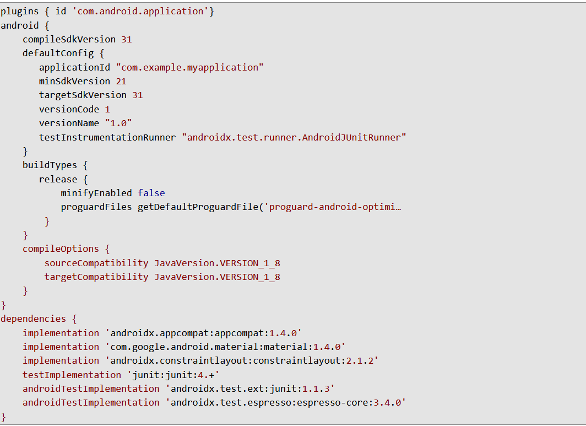

 

- compileSdk: Define la versión del sdk con la que compilamos la aplicación.

- applicationId: Identificador único de la aplicación, suele coincidir con el nobmre del paquete Java creado.

- minSdk: Define la versión del sdk mínima que requiere la aplicación. No podrá ser instalada en dispositivos con versiones anteriores y solo podremos usar las funcionalidades del API hasta ese nivel.

- targetSdkVersion: Versión más alta con la que se ha probado la aplicación.

- versionCode: Define la versión del código actual de la aplicación. Expresado mediante un número entero que deberá ser mayor para cada nueva versión publicada. Lo utilizará el desarrollador para comparar entre versiones.

- versionName: Contiene la cadena de texto que describirá la versión y que sí se mostrará a los usuarios de la aplicación.

- buildTypes: Configuración de las opciones de compilación que queramos.

- dependencies: Define todas las librerías que han de ser incluidas en el proyecto.
 

<h5>Componentes de una aplicación Android</h5>
 

    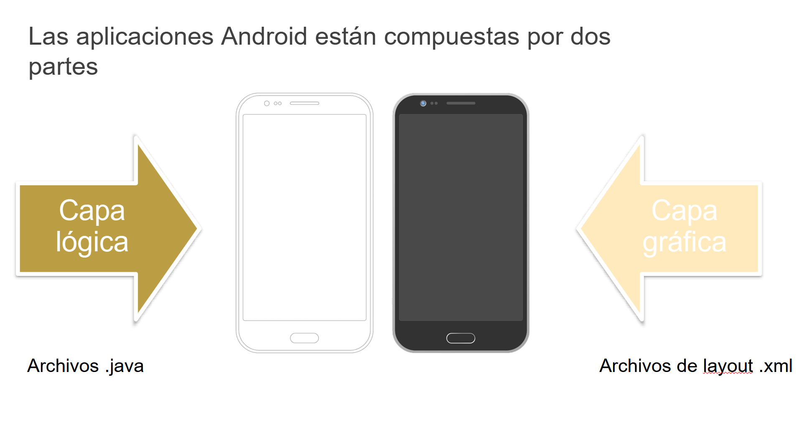

- Vista (view): Elementos que componen la interfaz de usuario de una aplicación. Por ejemplo: un botón o una caja de texto. Todas las vistas van a ser objetos descendientes de la clase View, y por tanto, pueden ser definidas utilizando código Java. Sin embargo, lo habitual será definir las vistas utilizando un fichero XML y dejar que el sistema cree los objetos por nosotros a partir de este fichero.

- Layout: Conjunto de vistas agrupadas de una determinada forma. Disponemos de diferentes tipos de layouts para organizar las vistas de forma lineal, en cuadrícula o indicando la posición absoluta de cada vista. Al igual que las vistas pueden definirse mediante código o XML.

- Activity: Las pantallas de la aplicación, se conocen como actividad. Su función principal es la creación de la interfaz de usuario y utiliza un layout que define su apariencia. Dicho de otro modo, una actividad es un programa pequeño y ligero, controlado por Android y sometido a sus normas de funcionamiento.

- Fragmentos (Fragment): Un fragmento está formado por la unión de varias vistas para crear un bloque funcional de la interfaz de usuario. Una vez creados los fragments, podemos combinar uno o varios fragments dentro de una actividad, según el tamaño de pantalla disponible. Concepto más avanzado y complejo.

- Servicio (Service): Procesos que se ejecutan “detrás” en segundo plano, sin la necesidad de una interacción con el usuario. Es algo parecido a un demonio en Unix o a un servicio en Windows. Se utilizan cuando queramos tener en ejecución un código de manera continua, aunque el usuario cambie de actividad.

- Intent: Voluntad de realizar alguna acción; como realizar una llamada de teléfono, visualizar una página web. Se utiliza para lanzar actividades, lanzar servicios, enviar anuncios broadcast, comunicarnos con un servicios y para el intercambio de información entre estos componentes.

- Receptor de anuncios (Broadcast Receiver): Se encarga de recibir anuncios broadcast y reaccionar ante ellos (batería baja, llamanda entrante).

- Proveedores de Contenido (Content Provider): Mecanismo  que nos permite que las aplicaciones puedan compartir datos entre ellas, sin necesidad de comprometer la seguridad del sistema de ficheros.

 

<h5>Ciclo de vida de una actividad Android</h5>
 

En Android cada aplicación es un proceso separado y el usuario no decide cuando finaliza, si no que es el propio sistema Android en función de las necesidades de memoria del momento.

   - [Información detallada sobre el ciclo de vida de una actividad](https://medium.com/@Emmitta/ciclo-de-vida-de-una-actividad-android-f30f8f2d1256)
 

   

       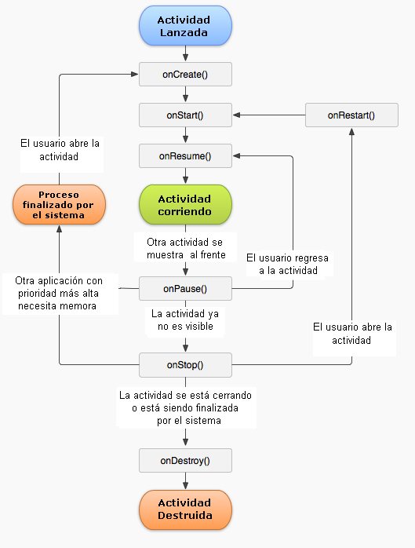
   

 

<h5>Emuladores Android</h5>
 

  - [Crear y administrar dispositivos virtuales - ADV](https://developer.android.com/studio/run/managing-avds?hl=es-419#about)

  - [Ejecutar apps en android emulator](https://developer.android.com/studio/run/emulator?hl=es-419)

  - [Ejecutar apps en un dispositivo físico](https://developer.android.com/studio/run/device?hl=es-419)

    
 Previamente, debes habilitar las opciones de desarrollador.<a href="https://developer.android.com/studio/debug/dev-options?hl=es-419" target="_blank" style="color: blue; font-weight:bold"> Más información aquí.</a>

    
Si el ordenador donde ejecutar las aplicaciones no es muy potente (nuestro caso en el aula), una opción es lanzar la aplicación directamente en nuestro teléfono móvil a través del cable usb. <a href="https://developer.android.com/codelabs/basic-android-kotlin-training-run-on-mobile-device?hl=es-419#0" target="_blank" style="color: blue; font-weight:bold">Más información aquí.</a>

    
 Otra opción en caso de ordenadores no muy potentes es probar con el emulador<a href="https://www.genymotion.com/" target="_blank" style="color: blue; font-weight:bold"> Genymotion</a>. Se trata de un emulador para el hardware de terminales reales que podemos instalarle una versión de Android y probar nuestras aplicaciones. Soporta virtualización por lo que si nuestro pc también lo soporta, la velocidad de ejecución aumentará.

 

<h5>DEPURACIÓN DE ERRORES EN ANDROID</h5>
 

<h5>Registros de una aplicación Android (LogCat)</h5>
 

 
El sistema Android utiliza el fichero LogCat para registrar todos los problemas y eventos principales que ocurren en el sistema. Ante cualquier error resulta muy interesante consultarlo para tratar de encontrar su origen.

 
La clase Log nos permite introducir volcar mensajes en este fichero desde nuestro código. Resultará útil para depurar nuestras aplicaciones o verificar nuestro código. Disponemos de varios tipos de mensajes: 

    - Log.e(): Errors - Mensajes de error.
    - Log.w(): Warnings - Mensajes de advertencias o alertas.
    - Log.i(): Information - Mensajes de información.
    - Log.d(): Debugging - Mensajes de depuración.
    - Log.v(): Verbose - Mensajes menos importantes.

  - [Información LogCat](https://developer.android.com/studio/debug/am-logcat?hl=es-419#java)
 
 

    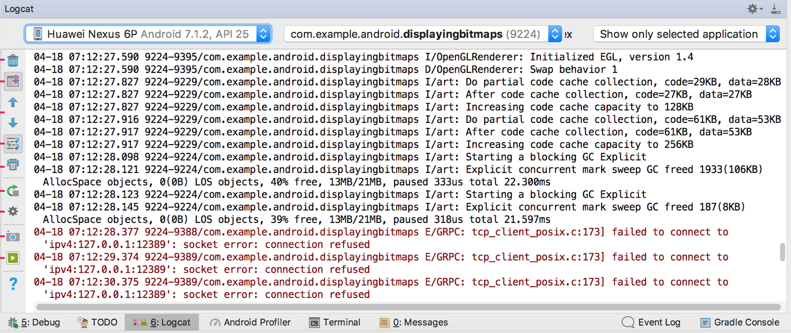

 

Durante la ejecución de la aplicación se pueden producir una gran cantidad de mensajes, de modo que podemos aplicar filtros para localizar los mensajes que son de nuestro interés: en la barra superior de esta misma ventana podemos filtrar por el paquete que identifica a la aplicación, por nivel (debug, info, error, warning) e incluso aquellos mensajes que contengan una palabra concreta.
 
 

<h5>Depurar aplicaciones con el entorno de desarrollo</h5>
 
 Android Studio nos permite introducir breakpoint's en el código con el fin de parar la ejecución de la aplicación y depurarlo, al igual que hacíamos con NetBeans.

 Podemos ejecutar la opción desde el menú: Run > Debug app o hacer click sobre el icono de debug.

 
 
 

**EJERCICIO 1:**

Crea tu primera aplicación siguiendo el codeLab: <a style="color:blue; font-weight:bold" href="https://developer.android.com/codelabs/basic-android-kotlin-training-first-template-project">https://developer.android.com/codelabs/basic-android-kotlin-training-first-template-project</a>.

Llama a tu proyecto "Ejercicio1+TuNombre". Ejecutalo en un emulador (crealo primero si no lo tienes ya o puedes crear otra configuración distinta) y en tu dispositivo físico por USB (habilita las opciones de depuración por usb).

Depurar tu aplicación con el entorno de desarrollo, para ello tendrás que añadir algún punto de parada (breakpoint) en el código java de tu actividad principal.

Depurar tu aplicación con LogCat, para ello tendrás que añadir algún mensaje de log en el código java de tu actividad principal. Comprueba que aparece en la ventana de LogCat.

No es necesario entregar este ejercicio.

