## :books: UD03 - Programación en Android: Interfaz de usuario

</br>
</br>

**OBJETIVOS DE LA UNIDAD:**

  1. **Diseño de la interfaz de usuario en una aplicación Android.**
  2. **Trabajar con vistas y sus propiedades.**
  3. **Layouts disponibles para organizar las vistas.**
  4. **Recursos y recursos alternativos.**
  5. **Interactuar con las vistas desde el código Java.**
  6. **Crear estilos y temas para personalizar nuestras aplicaciones.**  
  7. **Componentes Avanzados: ListView y RecyclerView.**
  8. **Construcción de menús.**

</br>

**INTERFACES DE USUARIO EN ANDROID:**

<h5>Introducción</h5>
</br>
La interfaz de usuario de Android está <span style="color:#b22222; font-weight:bold">basada en una jerarquía de clases descendientes de la clase View (vista)</span>. Una vista es un objeto que se puede dibujar y se utiliza como un elemento en el diseño de la interfaz de usuario (un botón, una imagen, una etiqueta de texto, etc.).
</br>
</br>
Cada uno de los elementos que se utilizan para crear la interfaz de nuestra aplicación, se define como una subclase de la clase View. Por ejemplo: la subclase para representar un texto es TextView.
</br>
</br>

<h5>Creación de una interfaz de usuario por código</h5>
</br>

Aunque no es la forma habitual de trabajar, debido a su complejidad,  podemos crear una interfaz de usuario directamente desde código java. Para ello, crea un nuevo proyecto con una actividad vacía en Android Studio y dentro de la actividad principal, copia el siguiente código (deberás hacer los import's necesarios de los paquetes que faltan):

    @Override public void onCreate(Bundle savedInstanceState) {
      super.onCreate(savedInstanceState);

      // Comentamos esta línea.
      //setContentView(R.layout.activity_main);

      // Creamos un textView de forma manual.
      TextView texto = new TextView(this);
      texto.setText("Hello World!");
      setContentView(texto);

    }

El constructor de la clase TextView, acepta como parámetro una instancia de la clase Context (contexto). Un contexto es un manejador del sistema que proporciona servicios como la resolución de recursos, obtención de acceso a bases de datos o preferencias entre otros.

La clase Activity es una subclase de Context, y como la clase MainActivity es una subclase de Activity, también es de tipo Context.

Por ello, puedes pasar this (el objeto actual de la clase MainActivity) como contexto del TextView para crearlo.

Lanza la aplicación en un emulador o dispositivo físico y observa el resultado.
</br>
</br>

<h5>Creación de una interfaz de usuario usando XML</h5>
</br>

Android permite el diseño de las interaces de usuario a través de ficheros XML (mucho más comodo). Accede al fichero res/layout/activity_main.xml del proyecto anterior.

<p align="center">
    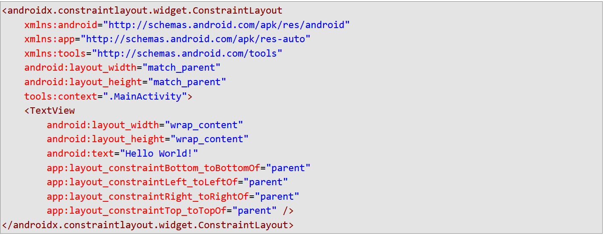
</p>


Vamos a analizar este XML...

- <span style="color:#b22222; font-weight:bold">constraintLayout</span>: elemento cuya función es contener otros elementos de tipo View. Tiene seis atributos:

  - <span style="color:orange; font-weight:bold">xmlns:android, xmlns:app y xmlns:tools</span>: son  declaraciones de  espacios de nombres de XML que utilizaremos en este fichero (este tipo de parámetro solo es necesario especificarlo en el primer elemento que engloba al resto).

  - <span style="color:orange; font-weight:bold">android:layout_width y android:layout_height:</span> permiten definir el ancho y alto de la vista. En este ejemplo, ocupará todo el espacio disponible.

  - <span style="color:orange; font-weight:bold">tools:context:</span> Indica la actividad asociada a este layout.

Dentro del constraintLayout, tenemos un elemento de tipo TextView.

- <span style="color:#b22222; font-weight:bold">TextView</span>: Nos permite mostrar un texto. Sus atributos son:

  - <span style="color:orange; font-weight:bold">android:layout_width y android:layout_height</span>: Definen el alto y alto del elemento (se ajustará al texto contenido).

  - <span style="color:orange; font-weight:bold">android:text</span>: Texto que se mostrará.

  - <span style="color:orange; font-weight:bold">app:layout_constraintBottom_toBottomOf, app:layout_constraintLeft_toLeftOf, app:layout_constraintRight_toRightOf y app:layout_constraintTop_toTopOf</span>: Posición del textView dentro del constraintLayout.

  - <span style="color:orange; font-weight:bold">android:id</span>: Para referenciar al objeto TextView.

Vuelve al proyecto anterior:

      @Override public void onCreate(Bundle savedInstanceState) {
        super.onCreate(savedInstanceState);

        setContentView(R.layout.activity_main);

        //Comentamos estas líneas.
        //TextView texto = new TextView(this);
        //texto.setText("Hello World!");
        //setContentView(texto);

      }

Lanza la aplicación en un emulador o dispositivo físico y observa el resultado (debe ser muy similar al anterior).

**El layout de una Activity hay que cargarlo en el Activity.onCreate() callback utilizando la función setContentView() pasándole el recurso layout correspondiente**.

Recordar que onCreate es un método callback que es llamado por Android cuando la Activity es lanzada.
</br>

<h5>Trabajar con vistas y sus propiedades desde Android Studio</h5>
</br>

Desde el propio entorno Android Studio, tenemos la posibilidad de crear y editar de forma visual las vistas de nuestra aplicación. La interfaz de usuario se construya a partir de objetos Vistas (Views) y Grupo de Vistas (ViewGroup).

Para ello, vamos a la carpeta de recursos del proyecto y abrimos cualquier fichero xml que tengamos en la carpeta de layout. Por ejemplo: <b>res/layout/activity_main.xml</b>.


<p align="center">
    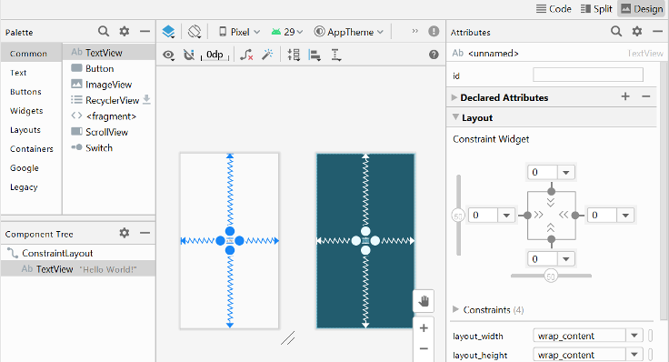
</p>
</br>


  - <span style="color:#b22222; font-weight:bold">Parte Izquierda</span>:

    - <span style="color:orange; font-weight:bold">Palette</span>: Contiene elementos predefinidos que podemos insertar de forma rápida en nuestra vista.

    - <span style="color:orange; font-weight:bold">Component Tree</span>: Contiene todos los elementos que contiene el layout que estamos editando.


  - <span style="color:#b22222; font-weight:bold">Parte central</span>:

    - <span style="color:orange; font-weight:bold">Menú superior:</span>
      Contiene varios controles para ajustar la configuración del dispositivo para el que estamos diseñando el layout. Nos permite ajustar la visualización (diseño, esquema o las dos), orientación (horizontal o vertical), tipo de dispositivio, versión de Android, aplicar algún tema y editar las traducciones.

    - <span style="color:orange; font-weight:bold">Centro:</span>
      Aparece como se verá el resultado (con fondo blanco) y una representación con los nombres de cada vista y su tamaño (fondo azul).

  - <span style="color:#b22222; font-weight:bold">Parte derecha</span>:
    - <span style="color:orange; font-weight:bold">Menú superior:</span>
       - <span style="color:green; font-weight:bold">Code</span>: Editar el codigo XML directamente.
       - <span style="color:green; font-weight:bold">Split</span>: Ambas opciones (código y visual).
       - <span style="color:green; font-weight:bold">Design</span>: Diseñar la vista de forma visual.</br></br>   
    - <span style="color:orange; font-weight:bold">Attributes:</span> Al seleccionar un elemento directamente la venta de previsualización o en el marco ComponentTree, en este apartado saldrán todas las propiedades disponibles para ese elemento, de tal forma que podremos ajustarlas para dejarlo como mejor nos convenga.

</br>

- El valor para el **atributo ID normalmente utiliza la sintaxis: “@+id/name”**
 -  +: indica que es un nuevo recurso y se creará un nuevo recurso integer en R si no existe ya. Si existe ya el recurso se omite el +.
 -  name: es el nombre del nuevo recurso en R.
 -  android: :Usando el XML Namespace (xmlns) android referenciamos a los recursos en android.
<br/>

<h5>Unidades de medida</h5>
</br>

Las <b>unidades de medida</b> más comunes son:

- <span style="color:#b22222; font-weight:bold">Match_parent</span>: Indica a la vista que se dimensiona tan grande como permita su contenedor que lo contiene.

- <span style="color:#b22222; font-weight:bold">Wrap_content</span>: Indica a la vista que se redimensione para ajustarse al contenido.

<b>Atributos de dimensión</b>: Permiten indicar la anchura o altura de una vista, margen, tamaño de texto o coordenadas.

- <span style="color:#b22222; font-weight:bold">px (píxeles)</span>: Estas dimensiones representan los píxeles en la pantalla.

- <span style="color:#b22222; font-weight:bold">mm (milímetros)</span>: Distancia real medida sobre la pantalla.

- <span style="color:#b22222; font-weight:bold">in (pulgadas)</span>: Distancia real medida sobre la pantalla.

- <span style="color:#b22222; font-weight:bold">pt (puntos)</span>: Equivale a 1/72 de una pulgada.

- <span style="color:#b22222; font-weight:bold">dp (píxeles independientes de la densidad)</span>: Presupone como base una pantalla de 160dpi (píxeles por pulgada). Si luego el dispositivo tiene otra densidad, se realizará el correspondiente ajuste. A diferencia de otras medidas como mm, in y pt este ajuste se hace de forma aproximada dado que no se utiliza la verdadera densidad gráfica, sino el grupo de densidad en que se ha clasificado el dispositivo (ldpi, mdpi, hdpi…). Esta medida presenta varias ventajas cuando se utilizan recursos gráficos en diferentes densidades. Por esta razón, **Google insiste en que se utilice siempre esta medida**. Desde un punto de vista práctico un dp equivale aproximadamente a 1/160 pulgadas. Y en dispositivos con densidad gráfica mdpi un dp es siempre un pixel.

- <span style="color:#b22222; font-weight:bold">sp (píxeles escalados)</span>: Similar a dp, pero también se escala en función del tamaño de fuente que el usuario ha escogido en las preferencias. **Indicado cuando se trabaja con fuentes**.

[<span style="color:blue; font-weight:bold">Vídeo con información detallada sobre unidades de medida.</span>](https://www.youtube.com/watch?v=2R796p7EIfo)

</br>

### Tipos de Layout Principales (Resumen)

- Un layout define la estructura visual del interfaz de usuario.
- Ayuda a la separación de la representación del código.

#### LinearLayout

  El LinearLayout apila todos los elementos hijo que tiene uno detrás de otro y puede ser en vertical __(uno debajo de otro)__ o en horizontal.

  <div align="center">
    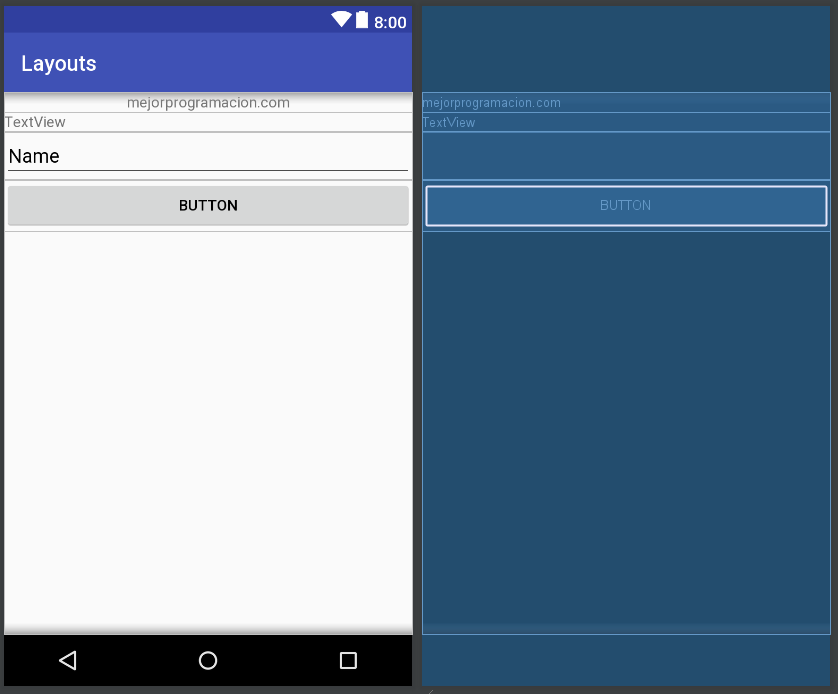<br/>
    <br/>
  </div>

  ___Por ejemplo la página de validación de nuestra aplicación podría ser de este tipo___.
<br/>

Algunos de sus atributos:

  - **Background**: color o imagen de fondo del contenedor.
  - **Padding**: Espacio de relleno entre el borde y los elementos de su interior.
  - **Layout Margin**: Espacio que se dejará por fuera del contenedor.
  - **Layout Gravity**: indica como actua la gravedad respecto al layout. Por ejemplo: "center" para obtener un margen igual en cada uno de los bordes.
<br/><br/>  

#### TableLayout

  Es una tabla definida (Filas y Columnas) en las que podemos poner los elementos, es muy parecido a una tabla en HTML. Distribuye los elementos de forma tabular.

  Dentro de la etiqueta de éste Layout para cada fila o row debemos poner utilizar la etiqueta **TableRow** para cada fila.

  <div align="center">
    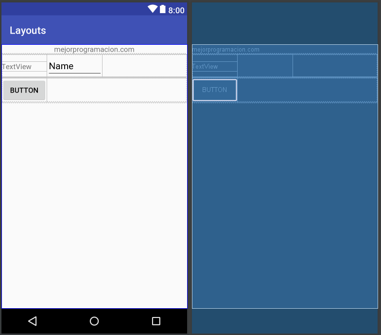
  </div>
<br/><br/>

Algunos de sus atributos:

  - **StretchColums**: indica las columnas que se pueden estirar.
  - **ShrinkColumns**: indica las columnas que se pueden encoger.
  - **Layout_span**: permite que un elemento se expanda a más de una columna.
  - **Layout_column**: indica en qué columna se ubicará un elemento determinado.
<br/><br/>  

#### RelativeLayout

  Este Layout posiciona los controles o elementos hijos de forma relativa entre unos y otros, por ejemplo: debajo de, o a la izquierda de. (siguiendo el orden en que aparecen en el fichero XML).

  Comenzamos a situar los elementos en cualquier de los cuatro lados del contenedor y vamos añadiendo nuevos elementos pegados a estos.

<div align="center">
  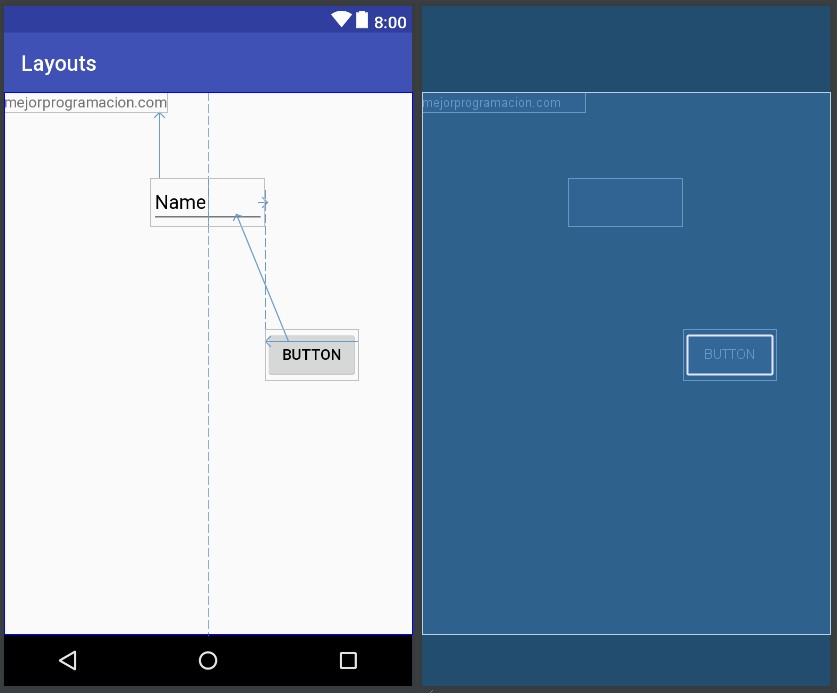
</div>
<br/><br/>

#### ConstraintLayout

   Versión mejorada (más flexible y eficiente) de RelativeLayout, que permite una edición visual desde el editor.

   Añadido en una librería de compatibilidad, usarlo de forma predeterminada. Permite crear diseños complejos sin la necesidad de usar layout anidados. Las posiciones de los elementos dentro de este layout, se definen usando constraints (restricciones).


   <div align="center">
     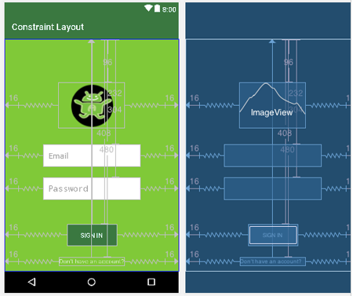<br/>
     <br/>
   </div>

   <div align="center">
     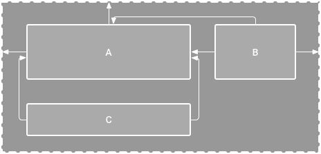<br/>
     <br/>
   </div>

- Este layout permite el diseño de forma gráfica mediante cajitas con enlaces laterales que pueden asociarse con el contenedor padre o entre las vistas. Los atributos de control de posición son:

  - **layout_constraintLeft_toLeftOf o toRightOf**: la vista se alineará a la izquierda de la parte izquierda o derecha del componente que se indique. El elemento al que hace referencia se indicará mediante el id o con la palabra clave parent, que indica que la posición es relativa al contenedor padre.

  - **layout_constraintRight_toLeftOf o toRightOf**: la vista se alineará a la derecha de la parte izquierda o derecha del componente que se indique.

  - **layout_constraintTop_toTopOf o toBottomOf**: la vista se alineará en lo alto de la parte superior o inferior del componente que se indique.

  - **layout_constraintBottom_toTopOf o toBottomOf**: la vista se alineará debajo de la parte superior o inferior del componente que se indique.

<br/>

#### FrameLayout

   Permite el cambio dinámico de los elementos que contiene.

   Posiciona las vistas usando todo el contenedor, sin distribuirlas espacialmente. Este Layout suele utilizarse cuando queremos que varias vistas ocupen un mismo lugar. Podemos hacer que solo una sea visible, o superponerlas.Para modificar la visibilidad de un elemento utilizaremos la propiedad visibility.

   <div align="center">
     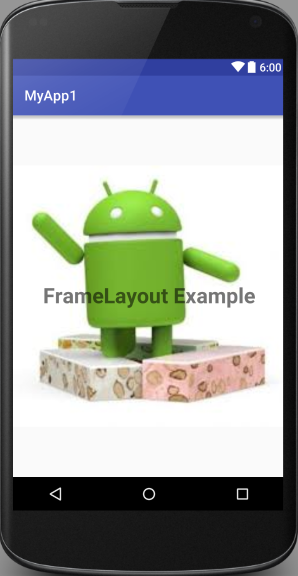<br/>
     <br/>
   </div>

<br/><br/>

#### AbsoluteLayout (Obsoleto)

  Posiciona los elementos de manera absoluta en pantalla según la posición indicada, seguramente es el Layout menos usado ya que dada la gran variedad en los tamaños de pantalla de los dispositivos móviles puede tener problemas en el total de área que se pueda mostrar en la pantalla, es decir, algunos elementos podrían no mostrarse por estar posicionados en un área que está por fuera de la pantalla.

  Cuando seleccionamos éste Layout en Android Studio nos damos cuenta de que la etiqueta la pone tachada y esto significa que está **obsoleta**, si podemos utilizarla pero debemos evitar su uso por las razones que vimos anteriormente.

<div align="center">
  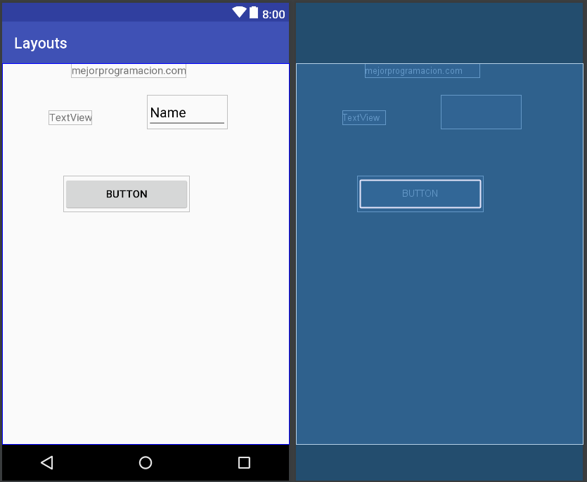<br/>
  <br/>
</div>

<br/><br/>

### Si tienes dudas de cuando usar cada layout, sigue las siguientes indicaciones...

-   **ConstraintLayout**: Usar por defecto.
-   **LinearLayout**: Diseños muy sencillos.
-   **RelativeLayout**: Nunca, hay una nueva alternativa
-   **FrameLayout**: Varias vistas superpuestas.
-   **AbsoluteLayout**: Nunca. Aunque está bien conocerlo por si acaso.


### Ejercicios de diseño con layouts:

<br/>

- **Ejercicio 1**: Creación de un layout utilizando un **LinearLayout (vertical)**. Añade los siguiente elementos: ToggleButton, CheckBox,SeekBar y RatingBar para crear la siguiente vista:

<br/>

<div align="center">
  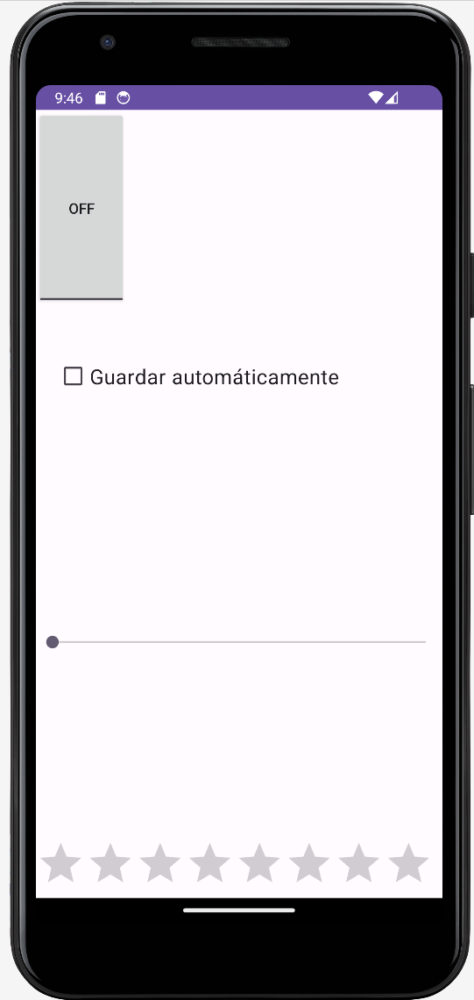<br/>
  <br/>
</div>

<br/><br/>

- **Ejercicio 2**: Creación de un layout utilizando un **LinearLayout**. Ves añadiendo diferentes tipos de entrada de texto **EditText**, de tipo normal, correo, password, etc.. Los encontrarás dentro del grupo Text Fields. Ejecuta la aplicación y observa como se comparta cada uno de ellos.

Por ejemplo: (**tendrás que personalizar el tipo de cada EditText**).

    <?xml version=”1.0” encoding=”utf-8”?>
      <LinearLayout xmlns:android=”http://schemas.android.com/apk/res/android”
        android:layout_width=”match_parent”
        android:layout_height=”match_parent”
        android:paddingLeft=”16dp”
        android:paddingRight=”16dp”
        android:orientation=”vertical” >
        <EditText
          android:layout_width=”match_parent”
          android:layout_height=”wrap_content”
          android:hint=”EditText 1” />
        <EditText
          android:layout_width=”match_parent”
          android:layout_height=”wrap_content”
          android:hint=”EditText 2” />
        <EditText
          android:layout_width=”match_parent”
          android:layout_height=”0dp”
          android:layout_weight=”1”
          android:gravity=”top”
          android:hint=”EditText 3” />
        <Button
          android:layout_width=”100dp”
          android:layout_height=”wrap_content”
          android:layout_gravity=”right”
          android:text=”Button 1” />
      </LinearLayout>

  - android:layout_height=”0dp”, no significa que la altura de ese EditText sea cero, sino que queremos que ocupe todo el espacio que sobra.

<br/>

- **Ejercicio 3**: Diseña la siguiente interfaz para simular una calculadora. Para ello tendrás que utilizar **ConstraintLayout** junto con **LinearLayout**.

    <br/>

    <div align="center">
      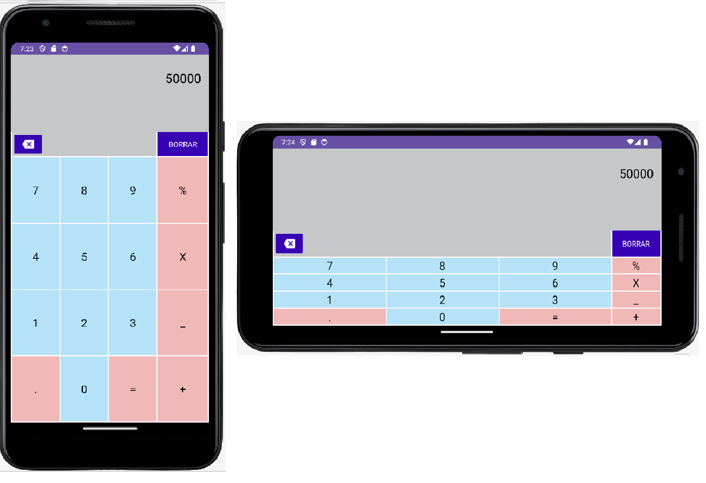<br/>
      <br/>
    </div>

<br/>

### También existen los contenedores (veremos algunos de ellos más adelante):

 - **ScrollView**: Visualiza una vista  en su interior; cuando estos no caben en pantalla se permite un deslizamiento vertical.

 - **HorizontalScrollView**: Visualiza una vista en su interior; cuando esta no cabe en pantalla se permite un deslizamiento horizontal.

 - **TabLayout , FragmentTabHost, TabLayout ó TabHost**: Proporciona una lista de pestañas que pueden ser pulsadas por el usuario para seleccionar el contenido a visualizar.

 - **ListView**: Visualiza una lista deslizable verticalmente de varios elementos.

 - **GridView**: Visualiza una cuadrícula deslizable de varias filas y varias columnas.

 - **RecyclerView**: Versión actualizada que realiza las mismas funciones que ListView o GridView.

 - **ViewPager**: Permite visualizar una serie de páginas, donde el usuario puede navegar arrastrando a derecha o izquierda. Cada página ha de ser almacenada en un fragment.


### Recursos en Android: ###

<br/>
Existen dos maneras de acceder a un recurso:
<br/><br/>

- **En código**: Usando un valor entero de una subclase de tu clase R; **por ejemplo: R.string.hello**

  donde string es el tipo de recurso y hello es el nombre del recurso. Hay muchas API de Android que pueden acceder a tus recursos cuando proporcionas un ID de recurso en este formato. Consulta Acceso a recursos en código.

- **En XML**: Usando una sintaxis XML que también corresponde al ID de recurso definido en tu clase R; **por ejemplo: @string/hello**

  donde string es el tipo de recurso y hello es el nombre del recurso. Puedes usar esta sintaxis en un recurso XML en cualquier lugar donde esté previsto que proporciones un valor en un recurso. Consulta Acceso a recursos desde XML.


### Tipos de recursos ###

Para añadir un recurso a nuestra aplicación es muy sencillo, solo tenemos que añadir un fichero dentro de una carpeta determinada de nuestro proyecto. Para cada uno de los recursos que añadamos el sistema crea, de forma automática, un id de recurso dentro de la clase R.

 - **Tipos de recursos genéricos**:

<div align="center">
  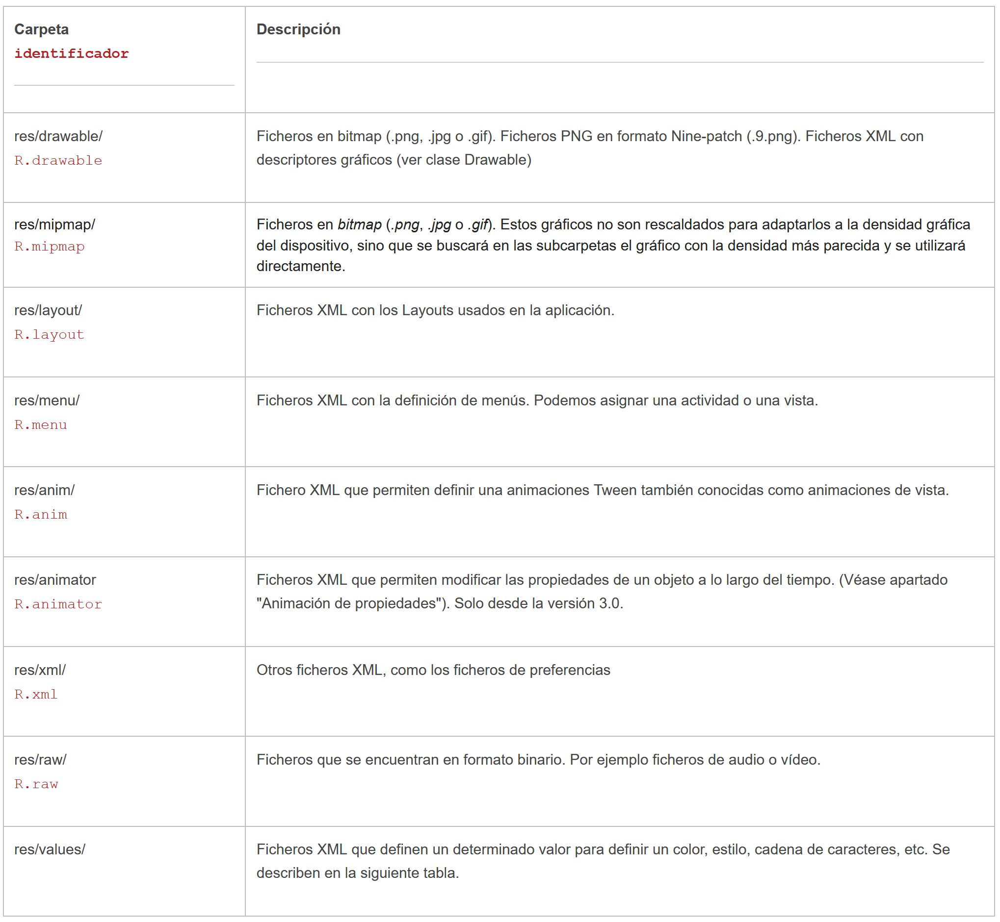<br/>
  <br/>
</div>
<br/>

 - **Tipos de recursos dentro de la carpeta values**:

<div align="center">
 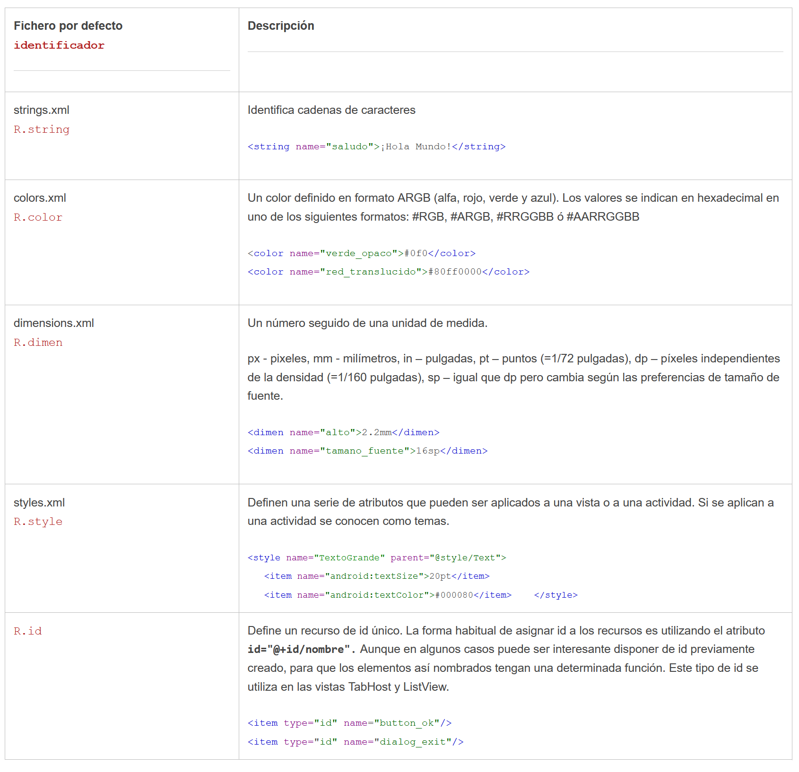<br/>
 <br/>
</div>
<br/>

### Acceso a los recursos.

Una vez definido un recurso este puede ser utilizado. Archivos involucrados: string.xml, dimen.xml, menus.xml, colors.xml, style.xml,...

- Para acceder **desde XML** usaremos:

<div align="center">
  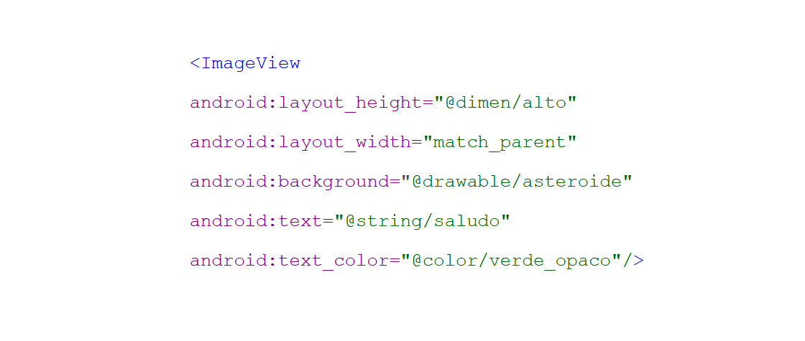<br/>
  <br/>
</div>
<br/>

- Para acceder desde **código java** usamos:

            Resources res = getResources();
            Drawable drawable = ContextCompat.getDrawable(R.drawable.imagen);
            String saludo = res.getString(R.string.saludo);
            int color = ContextCompat.getColor(R.color.verde_opaco);
            float tamanoFuente = res.getDimension(R.dimen.tamano_fuente);            


### Recursos Alternativos en Android:
<br/>

Una aplicación puede ser ejecutada en una gran variedad de dispositivos. El tamaño de pantalla, la resolución o el tipo de entrada puede variar mucho de un dispositivo a otro. Además de diferentes idiomas.

Cuando creamos una aplicación, debemos tener en cuenta todo esto. Afortunadamente, la plataforma de desarrollo nos proporciona herramientas para resolver estos problemas: los recursos alternativos.

Android utiliza una lista de sufijos para expresar recursos alternativos. Estos sufijos pueden hacer referencia a la orientación del dispositivo, al lenguaje, la región, la densidad de píxeles, la resolución, el método de entrada, etc.

**Por ejemplo, si queremos traducir nuestra aplicación al español e inglés**. Siendo el español, el idioma usado por defecto, crearíamos dos versiones del fichero strings.xml y lo guardaríamos en los siguientes directorios:
<br/><br/>

<div align="center">
 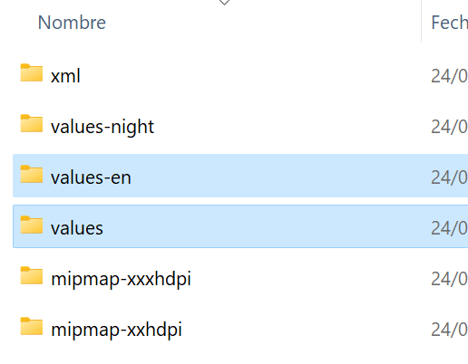<br/>
 <br/>
</div>

Aunque internamente el SDK de Android utiliza esa estructura de carpetas, en Android Studio, el proyecto muestra los recursos de la siguiente manera.

<div align="center">
  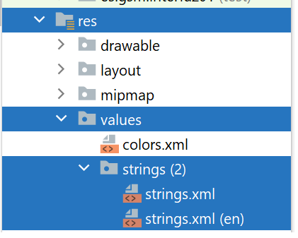<br/>
  <br/>
</div>


**Para crear un nuevo recurso alternativo**, pulsamos con el botón derecho del ratón sobre la carpeta res/values, y seleccionamos la opción **"New > Values Resource File"**.

A continuación, escribimos el nombre del fichero de recursos "strings.xml", el directorio donde se alojará que vendrá definido según el idioma con el sufijo (es, en, ca, fr, it, etc..). Como "Available qualifier" seleccionamos "Locale" y luego filtramos por el lenguaje tal y como vemos en la imagen (eng y Any Region). Con ello nos creará otro fichero "strings.xml" en la carpeta "values-en", donde podamos traducir las etiquetas que usamos en nuestra aplicación al idioma inglés.<br/><br/>

<div align="center">
 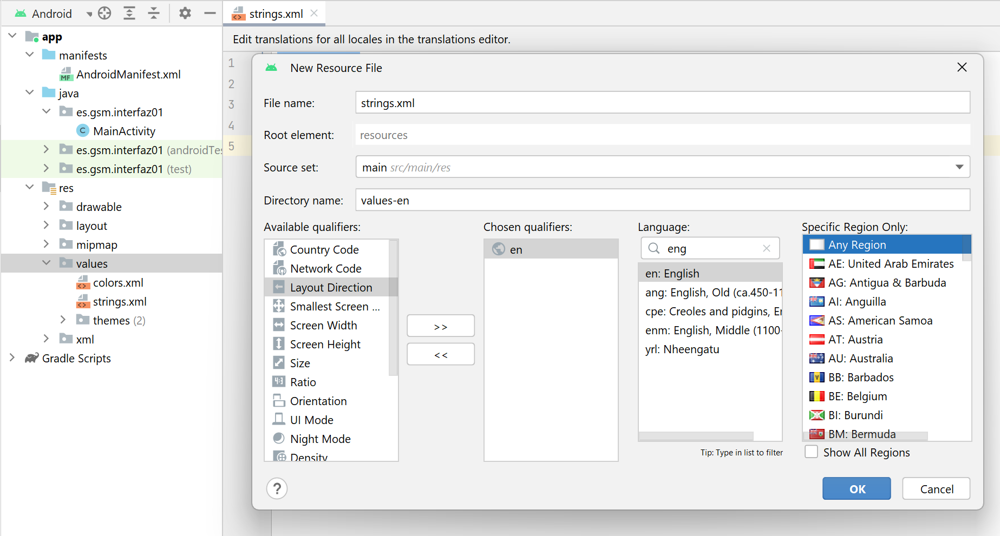<br/>
 <br/>
</div>
<br/><br/>
De esta forma, cuando nuestra aplicación, arranque en un dispositivo identificará el idioma del mismo y mostrará los textos de la aplicación en español (por defecto) o inglés en caso de que tenga ese idioma configurado.
<br/><br/>

Otro ejemplo de utilización de recursos diferenciados lo podemos ver con el icono que se utiliza para lanzar la aplicación. Observa como, al crear una aplicación, este icono se crea en cinco carpetas drawable diferentes, para utilizar un icono distinto según la densidad de píxeles del dispositivo:

<div align="center">
 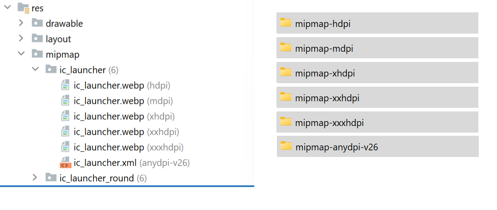<br/>
 <br/>
</div>

### Recursos del sistema
<br/>

Además de los recursos que podemos añadir a nuestra aplicación, también **podemos utilizar una serie de recursos que han sido incluidos en el sistema.**

Usar recursos del sistema tiene muchas ventajas. No consumen memoria en nuestra aplicación, al estar ya incorporados al sistema. Además los usuarios están familiarizados con ellos. Otra ventaja es que los **recursos del sistema se adaptan a las diferentes versiones de Android**.

Este tipo de recursos del sistema se adaptan a las diferentes versiones de Android.

Por ejemplo: android.R.string.cancel este será “Cancelar”, “Cancel”, etc.. según el idioma.

 - **Acceso a recursos del sistema desde código**: usaremos la clase **android.R.** Por ejemplo: android.R.drawable.ic_menu_edit.

 - **Acceso a recursos del sistema desde XML**: usaremos la sintaxis habitual pero comenzando con **@android:**. Por ejemplo: @android:drawable/ic_menu_edit.

<br/>

### Elementos dentro de un Layout

  Algunos de los elementos que puede contener un layout son:

  - **TextView**: representa un **texto estático** para el usuario, aunque **podemos cambiar su texto desde código**. Puede servirnos para presentar información al usuario, como mensajes o etiquetas de otros componentes

  - **EditText**: representa un **campo de texto que el usuario puede rellenar**. Podemos crear un filtro de entrada, de modo que si, por ejemplo, solo queremos números, el campo solo acepte números, etcétera.

  - **Button**: un componente que **el usuario puede presionar para obtener alguna función**. Estableceremos un **listener o el atributo onClick** para definir las acciones que efectuar cuando sea pulsado.

  - **Image Button**: un **botón** exactamente igual al anterior, con la diferencia de **que podemos añadirle un icono** para un mejor aspecto visual de su función.

  - **Image View**: representa una **imagen estática**, aunque **podemos cambiarla dinámicamente mediante el código**. Puede servirnos para mejorar el aspecto de la interfaz gráfica o para presentar una imagen real relacionada con datos.

  - **Switch**: representa un interruptor, puede estar en on o en off. Puede servirnos
para presentar al usuario dos opciones posibles de las que debe escoger una.

  - **CheckBox buttons**: representa una **opción seleccionable**. Mostrando si una opción esta activa o no.

  - **RadioButton**: representa **opciones que son excluyentes**, es decir, si eliges una opción, las demás se desactivarán

  - **Date Picker**: representa un diálogo para seleccionar una fecha.

  - Etc...

<br/>

### Interacturar con las vistas desde código Java.
<br/>

**Ejemplo: Definir un botón junto con su acción asociada al pulsarlo**.

<div align="center">
  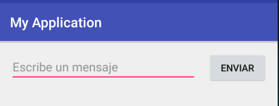<br/>
  <br/>
</div>

  - **Definir la vista en el layout asignando un id**.

        <Button android:id="@+id/my_button"
          android:layout_width="wrap_content"
          android:layout_height="wrap_content"
          android:text="@string/my_button_text"/>

  - **Crear una instancia de la vista referenciando al elemento en el current layout**.

         Button myButton = (Button) findViewById(R.id.my_button);

  - Cuando el usuario pulsa el botón, tenemos que **capturar el evento generado y ejecutar la acción correspondiente desde el código**. Tenemos varias opciones: <br/>

  1. **Vinculando una función en el atributo onClick de la View en la vista de diseño**.      

      Creamos una función en nuestra clase para tratar ese evento...

         public class MainActivity extends AppCompatActivity {    

           @Override
           protected void onCreate(Bundle savedInstanceState) {
              super.onCreate(savedInstanceState);
              setContentView(R.layout.activity_main);
          }

          protected void Enviar(View view){
             // código a ejecutar cuando sea pulsado
            Toast.makeText(this,"Hola",Toast.LENGTH_LONG).show();
          }

         }

      y en el atributo onClick de la paleta de atributos del componente, establecemos esa función.

      <div align="center">
        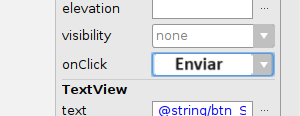<br/>
        <br/>
      </div>

  <br/>

  2. **Utilizando un setOnClickListener() en el código Java**.

      Para usar esta alternativa no ponemos nada en el atributo onClick en modo de diseño. El código de ejemplo sería:

         public class MainActivity extends AppCompatActivity {     

             @Override
             protected void onCreate(Bundle savedInstanceState) {
                 super.onCreate(savedInstanceState);
                 setContentView(R.layout.activity_main);

                 Button btnEnviar = (Button) findViewById(R.id.my_button);

                 btnEnviar.setOnClickListener(new View.OnClickListener() {
                   @Override
                   public void onClick(View v) {
                     // código a ejecutar cuando sea pulsado
                     Toast.makeText(this,"Hola",Toast.LENGTH_LONG).show();
                   }
                 });
            }
         }     

  3. **Que la clase MainActivity implemente el interfaz onClickListener()**.

     Para implementar una interfaz debemos indicarlo en la definición de la clase e implemenar los métodos que definen la interfaz. En este caso el método onClick.

         public class MainActivity extends AppCompatActivity implements View.OnClickListener {

            protected View btnEnviar;

            @Override
            protected void onCreate(Bundle savedInstanceState) {
                super.onCreate(savedInstanceState);
                setContentView(R.layout.activity_main);

                btnEnviar = (Button) findViewById(R.id.my_button);
                btnEnviar.setOnClickListener(this);
            }

            @Override
            public void onClick(View view) {
                Toast.makeText(MainActivity.this,"Hola amigos", Toast.LENGTH_LONG).show();
            }
         }

        **¿Y si tenemos más de un View en mi activity que reciba onClicks?**

        Entonces podemos jugar con la View que recibe el método onClick() que estamos implementando y preguntando por el id de la vista podremos usar un switch para hacer una cosa u otra.

         @Override
         public void onClick(View v) {
            Button b = (Button) v;
            switch(b.getId()) {
                case R.id.my_button:
                    // Do something
                    break;
                case R.id.my_button2;
                    // Do something
                    break;
                ...
            }
         }
<br/><br/>

### Ejercicios interactuar con las vistas desde código Java.

<br/>

- **Ejercicio 4**: Crear una nueva aplicación con un layout similar al mostrado en la imagen.

    Cuando pulsemos el botón de saludo, la aplicación nos mostrará un mensaje mediante un **Toast** con un saludo.

    Para ello, hemos de utilizar el evento onClick del botón y getText() del EditText donde introducimos nuestro nombre.
<br/>

<div align="center">
  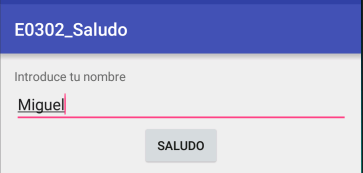<br/>
  <br/>
</div>


<br/>

- **¿Qué es un toast?**: Se utilizan para dar feedback a los usuarios de nuestra aplicación, en forma de un pequeño popup.

  Se muestran durante un tiempo pequeño sobre la vista actual (no se abre otra nueva pantalla).

      Toast.LENGTH_SHORT;
      Toast.LENGTH_LONG;

  Se usan para informar de algo o confirmar al usuario su acción. Por ejemplo, decirle que ha pulsado el boton con el texto vacio… etc.

      Context context = getApplicationContext();
      CharSequence text = "Hello toast!";
      int duration = Toast.LENGTH_SHORT;
      Toast toast = Toast.makeText(context, text, duration);
      toast.show();

      o simplificando...

      Toast.makeText(getApplicationContext(), "Hola mundo", Toast.LENGTH_LONG).show();

<br/>

### Temas y estilos para personalizar nuestra aplicación.

<br/>

Un **tema** es una **colección de atributos que se aplican a toda una app, actividad o jerarquía de vistas, no solo a una vista individual**.

Un **estilo** es una colección de propiedades que **definen el formato y apariencia que tendrá una vista**. Podemos especificar cosas como tamaño, márgenes, color, fuentes, etc. Un estilo **se define en ficheros XML**,  diferente al fichero XML Layout que lo utiliza.

El siguiente codigo:


<div align="center">
  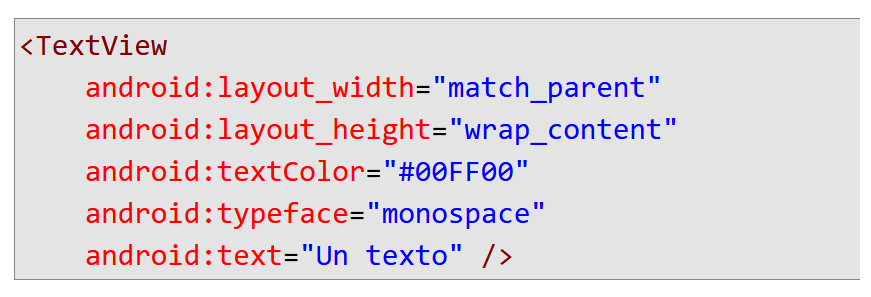<br/>
  <br/>
</div>

Equivale a lo siguiente:

<div align="center">
  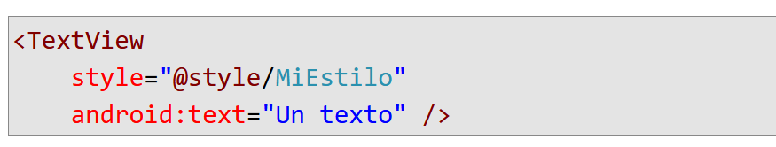<br/>
  <br/>
</div>

Creando previamente en el fichero res/values/styles.xml lo siguiente:

<div align="center">
  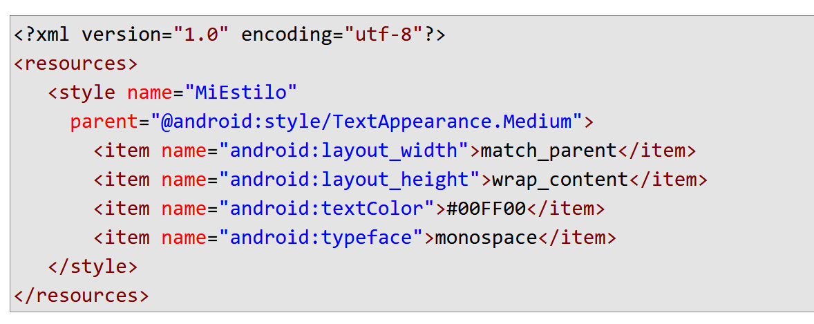<br/>
  <br/>
</div>

Un estilo puede heredar todas las propiedades de un padre (parámetro parent) y a partir de estas realizar modificaciones.

<br/>


### Heredar de un estilo propio
<br/>

**Si vas a heredar de un estilo definido por ti no es necesario utilizar el atributo parent**. Por el contrario, puedes utilizar el mismo nombre de un estilo ya creado y completar el nombre con un punto más un sufijo. Por ejemplo:

<div align="center">
  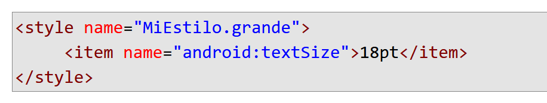<br/>
  <br/>
</div>

Crearía un nuevo estilo que sería igual a **"MiEstilo"**, más la nueva propiedad indicada.

<br/>

### Definición de paleta de colores de la aplicación
<br/>

Cada aplicación ha de definir su propia paleta de colores que la diferencie del resto de aplicaciones. Incluso la barra de estado de Android cambiará para que combine con los colores de nuestra aplicación.

Si tu aplicación va a seguir las especificaciones de <a href="https://es.wikipedia.org/wiki/Material_Design">Material Design</a>, lo primero que has de hacer es escoger la paleta de colores que va a utilizar.

Para ello puedes utilizar la herramienta de **https://www.materialpalette.com/**.

Selecciona primero el color primario de tu aplicación y a continuación el color que resalte. A continuación, a la derecha te aparecerá una previsualización de una aplicación con esos colores junto con un perfil de colores recomendados que puedes utilizar en tu aplicación.

Puedes utilizar estos códigos para personalizar los estilos del tema aplicación por defecto a tu aplicación.

Definiéndolos en res/values/colors.xml y utilizándolos en el fichero /res/values/styles.xml.

<div align="center">
  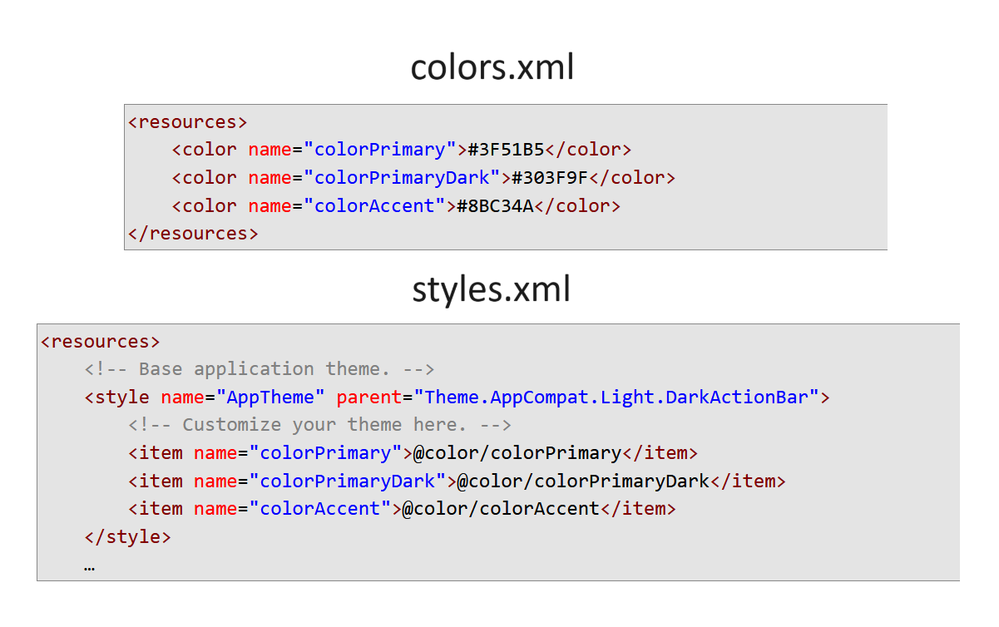<br/>
  <br/>
</div>

En el fichero AndroidManifest.xml, podemos asignar el tema a nuestra aplicación.

<div align="center">
  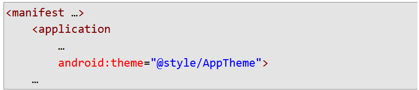<br/>
  <br/>
</div>

<br/>


### Ejercicios definición de estilos y colores de nuestra aplicación.

<br/>

- **Ejercicio 5**: Retoma la aplicación "Calculadora" del ejercicio 3 anterior y define los colores y estilos necesarios para aplicarselo a los botones. Crea al menos dos estilos distintos (uno para los botones de los dígitos (azules) y otro para los botones de las operaciones (rosados)).

<br/>


### COMPONENTES AVANZADOS EN ANDROID: ListView y RecyclerView.

### Listas (ListView (y CustomAdapter))

Es un componente que permite crear una lista de elementos más o menos compleja, muy similar a Spinner pero en este caso, la lista se muestra expandida pudiendo ocupar incluso toda la pantalla del dispositivo.

Para el caso más sencillo de ListView tendremos que disponer de una serie de datos simples para mostrar, por ejemplo una lista de cadenas de texto, números o similar.

```
. . .
List<String> lista = new ArrayList<String>();
lista.add("Primer elemento");
lista.add("Segundo elemento");
. . .
ListView lvLista = (ListView) findViewById(R.id.lvLista);
ArrayAdapter<String> adapter = new ArrayAdapter<String>(
                               this, android.R.layout.simple_list_item_1, lista);
lvLista.setAdapter(adapter);
. . .
```
Si necesitamos alguna presentación más compleja, necesitaremos crearnos un layout personalizado y además implementar la clase que se asociará con dicho layout para indicarle a Android como queremos rellenarlo.

* [**Consultar el proyecto realizado durante la clase "listaCiudadesPersonalizadasSimple"**](https://github.com/docmodulos/pmdm2324/blob/main/UD03/proyectos/clase/listaCiudadesPersonalizadasSimple)

* [**Y el proyecto (con custom adaptor) realizado durante la clase "listaCiudadesPersonalizadasCompleta"**](https://github.com/docmodulos/pmdm2324/blob/main/UD03/proyectos/clase/listaCiudadesPersonalizadasCompleta)


### CONSTRUCCIÓN DE MENÚS

A continuación, veremos como agregar menús a nuestras aplicaciones.

- Los menús se suelen colocar en una barra de la aplicación para mostrar las acciones más comunes al usuario. Tenemos de varios tipos:

  - **Menús de opciones o ajustes (settings)**: Salen en la barra de acción de tu aplicación (AppBar).
  - **Menús contextuales**: Menús flotantes que aparecen al hacer click de forma prolongada sobre un elemento de la interfaz.
  - **Menús de Pop-up**: Visualizan elementos de menú en una lista vertical.
  - **Submenús**: Muestran distintas opciones del submenú.

<br>

Para utilizar un recurso menú, tenemos que:

  1. Crear la carpeta "Menu" ("Menu resource directory") dentro de tu proyecto.

  <div align="center">
    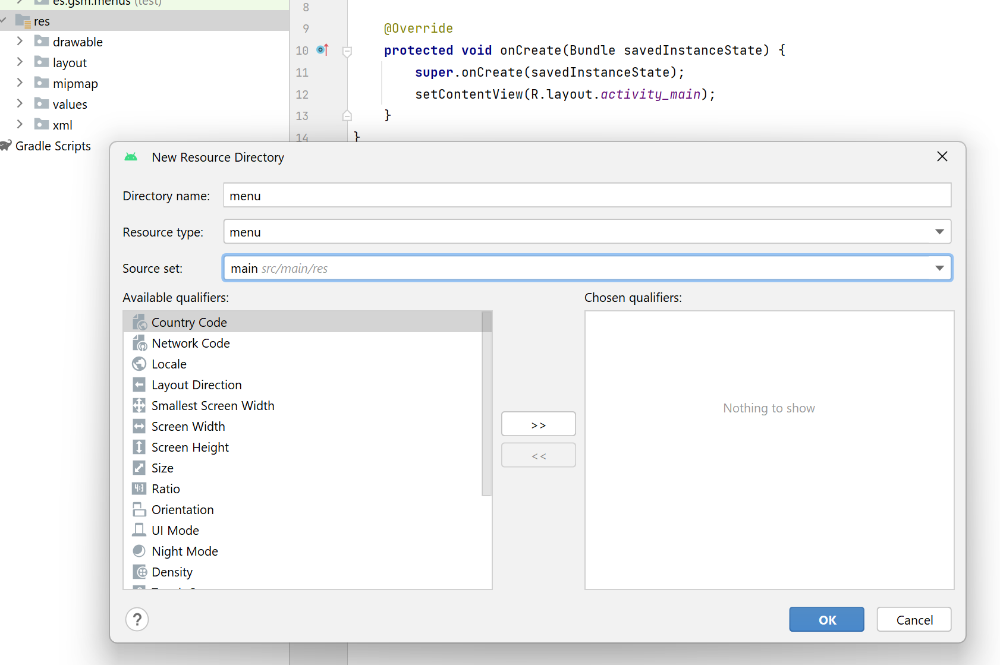<br/>
    <br/>
  </div>


  2. Definir un archivo de recursos XML ("Menu resource file") dentro de la carpeta "Menu" del proyecto.
       - Etiqueta ```<menu>``` describe un grupo de elementos ```<item>``` que será cada entrada del menú.  


  <div align="center">
    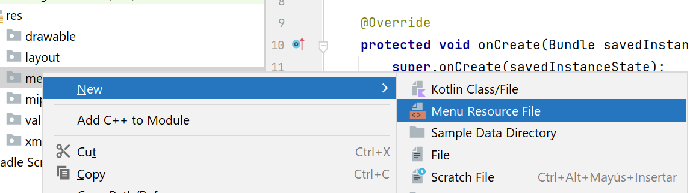<br/>
    <br/>
  </div>

  3. Sobreescribir la función onCreateOptionsMenu para inflar el recurso creado anteriormente.     


### Referencias

  - [Tipos y trabajo con layouts en android](https://developer.android.com/guide/topics/ui/declaring-layout?hl=es-419).

</br>
