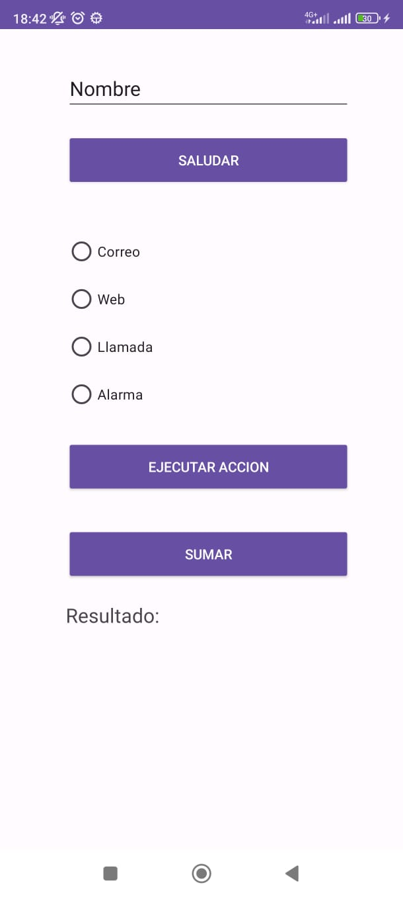

#  :iphone: Programación Multimedia y Dispositivos Móviles 2023/2024

## :books: UD04 - Programación en Android: Comunicaciones

</br>
</br>

**OBJETIVOS DE LA UNIDAD:**

  1. **Comunicaciones con otros componentes.**
  2. **Vinculación de vistas (ViewBinding).**
  3. **Permisos en aplicaciones Android.**


</br>

### COMUNICACIONES CON OTROS COMPONENTES EN ANDROID:

### Actividades

  * [**Consultar documento "Actividades - Intents.pdf"**](https://github.com/docmodulos/pmdm2324/blob/main/UD04/Actividades%20-%20Intents.pdf)

  * [**Consultar documento "Actividades - Ciclo de vida.pdf"**](https://github.com/docmodulos/pmdm2324/blob/main/UD04/Actividades%20-%20Ciclo%20de%20vida.pdf)

### Resumen sobre manejo de actividades: ###
<br/>

Una activity básica (pantalla) consta de:

- .xml parte gráfica, definido por Views (layouts, botones, listas, fragments, etc.): Cada elemento tiene sus propiedades (width y heigth son básicas, id muy recomendable) y se organizan mediante layouts.

```
<Button  
  android:layout_width="wrap_content"  
  android:layout_height="wrap_content"  
  android:id="@+id/botonArrancar" />
```

- .java parte lógica de la aplicación (operaciones, gestión de datos, etc.): Una clase normal que extiende de Activity (ahora AppCompactActivity). Por herencia obtiene numerosos métodos. Deben estar declaradas en el androidmanifest.xml

- Adicionamiente podrá contener más elementos como menús, popups, servicios, tareas asíncronas, etc.

****

Asociación parte gráfica y parte lógica: método setContentView (ojo, solo sobre una activity)

```
@Override  
protected void onCreate(Bundle savedInstanceState) {  
    super.onCreate(savedInstanceState);  
    setContentView(R.layout.activity_main);  
  }  
}
```

Asociación elemento declarado en el xml con elemento declarado en el .java: método findViewById (sobre la vista asociada en el primer paso) o mediante view binding con librerias externas.
```
Button boton = findViewById(R.id.botonArrancar);
```

****
### Comunicación entre actividades

Existen dos tipos de intenciones:

  - **Intenciones explícitas**: se indica exactamente el componente a lanzar. Su utilización típica es la de ir ejecutando los diferentes componentes internos de una aplicación. Por ejemplo, desde la actividad principal lanzamos la actividad "AcercaDeActivity" por medio de una intención explicita.

  - **Intenciones implícitas**: pueden solicitar tareas abstractas, como “quiero tomar una foto” o “quiero enviar un mensaje”. Además las intenciones se resuelven en tiempo de ejecución, de forma que el sistema mirará cuantos compomentes han registrado la posibilidad de ejecutar ese tipo de intención. Si encuentra varias el sistema puede preguntar al usuario el componente que prefiere utilizar.

    - Más información sobre estas tareas/acciones: https://developer.android.com/guide/components/intents-common

      <div align="center">
        <br/>
        <br/>
      </div>

    - Algunas de estas acción, junto con sus URI y resultados:

      <div align="center">
        <br/>
        <br/>
      </div>

- **Consultar ejemplo completo de código sobre actividades en (proyectos/clase/ejemploActividades)**


### Los intents marcan acciones a realizar dentro de una aplicación.

Para pasar de una actividad a otra:

1. Declaración de todas las actividades en el manifest
```
 <activity android:name=".MainActivity">  
    <intent-filter>
      <action android:name="android.intent.action.MAIN" />  
      <category android:name="android.intent.category.LAUNCHER" />  
    </intent-filter>
 </activity>  
 <activity android:name=".SecondActivity"></activity>
```
2. Creación de un objeto de tipo intent en la pantalla origen donde se pasa como parámetro el contexto y la clase de la pantalla que se quiere abrir
```
//arrancar la segunda actividad  
Intent intent = new Intent(getApplicationContext(),SecondActivity.class);  
```
3. Arrancar el intent creado
```
startActivity(intent);  
```


***

### Para pasar datos entre actividades se sigue el mismo concepto, añadiendo todos los datos a pasar mediante par clave-valor:


1. Declaración del intent y añadir los datos
```
Intent intent = new Intent(getApplicationContext(),SecondActivity.class);  
//pasarle un dato concreto  
intent.putExtra("clave_asociada","dato a pasar");  
```

2. Arrancar la actividad
```
startActivity(intent);  
```
3. Recoger los datos en la actividad destino
```
String recuperar = getIntent().getStringExtra("clave_asociada");
```
   o bien:
```
Bundle b = getIntent().getExtras();
String recuperar = b.getString("clave_asociada");
```

***
### Pasar de una actividad a otra esperando resultado

Mismo concepto que el anterior pero la actividad que arranca no finaliza y espera que se le comunique un dato.

1. Arrancar la segunda actividad desde la primera (igual que el punto anterior), añadiendo un código en el método startActivityForResult() (normalmente debe ser una constante).
```
//arrancar la segunda actividad  
Intent intent = new Intent(getApplicationContext(),SecondActivity.class);  
//pasarle un dato concreto  
intent.putExtra("clave_asociada","dato a pasar");  
startActivityForResult(intent,1);
```
2. Una vez abierta la segunda actividad, poner el resultado en la segunda actividad y cerrarla. Utilizando el método setResult, con un código de respuesta y los datos que se quieren pasar
```
Bundle b = getIntent().getExtras()
String recuperar = b.getString("clave_asociada");
Intent intentRespuesta = new Intent();  
intentRespuesta.putExtra("clave_respuesta","dato a pasar");  
setResult(2,intentRespuesta);  
finish();
```
3. Procesar el resultado en la primera actividad, donde requestCode es el código lanzado en la primera actividad y requestCode el código obtenido con el resultado.
```
@Override  
protected void onActivityResult(int requestCode, int resultCode, @Nullable Intent data) {  
    super.onActivityResult(requestCode, resultCode, data);  
    if (requestCode == 1){  
        if (resultCode == 1){  
            data.getStringExtra("clave_respuesta");  
        }  
    }  
}
```
***

### Guardar y recuperar el estado

Por cada cambio en la configuración o pausado de las aplicaciones, se pueden eliminar datos que estén presentes en elementos de la interfaz gráfica. Por ello, se debe guardar el estado sobreescribiendo el método onSaveInstanceState() y utilizando el objeto de tipo bundle. Para recuperarlo se utiliza el objeto de tipo bundle dado en el método onCreate().

1. Guardar el estado mediante par clave valor. Método llamado automáticamente cuando la aplicación vaya a pausa:
````
    @Override
    protected void onSaveInstanceState(Bundle savedInstanceState) {
        savedInstanceState.putString("clave_dato1", "dato a guardar");
        savedInstanceState.putString("clave_dato2", "dato a guardar");
        super.onSaveInstanceState(savedInstanceState);
    }
````

2. Recuperar estado con el método onRestoreInstanceState() llamado automáticamente cuando la activity vuelve
```
@Override
protected void onRestoreInstanceState(Bundle savedInstanceState){
    super.onSaveInstanceState(savedInstanceState);
    String dato1 = savedInstanceState.getString("clave_dato1");
    String dato2 = savedInstanceState.getString("clave_dato2");
}
```
  ó utilizar el propio onCreate para hacer lo mismo directamente
```
@Override
protected void onCreate(Bundle savedInstanceState) {
    super.onCreate(savedInstanceState);
    if (savedInstanceState != null) {
        String dato1 = savedInstanceState.getString("clave_dato1");
        String dato2 = savedInstanceState.getString("clave_dato2");
    } else {

    }
}
```
<br/>

### Ejercicios de comunicación entre actividades (intents implícitos y explicítos)

<br/>

  * [**Antes de realizar la actividad, consultar el proyecto realizado durante la clase "ejemploActividades"**](https://github.com/docmodulos/pmdm2324/blob/main/UD04/proyectos/clase/ejemploActividades)

<br/>

- **Ejercicio 6**: Diseña una aplicación "actividades01" que tenga el siguiente aspecto.

<br/>
<div align="center">
  <br/>
  <br/>
</div>

- **La aplicación de la siguiente manera:**

   - **En el editText "Nombre", el usuario introducirá su nombre**. Al pulsar sobre el **botón "SALUDAR", será redirigido a una nueva pantalla**, donde se mostrará dentro de un textView, el siguiente mensaje **"Buenos días" junto con el nombre que se había introducido en la pantalla anterior.**

   - **En el siguiente radioGroup, el usuario seleccionará una opción a ejecutar de las cuatro disponibles**, posteriormente al pulsar sobre el **botón "EJECUTAR ACCION"**, se revisará que opción ha seleccionado el usuario y se lanzará la acción correspondiente. Nota: Los parámetros del correo, la web a abrir, el tel a llamar  así como la hora y minutos para establecer la alarma os los podéis inventar.

   - **En el último apartado, el usuario pulsará sobre el botón "SUMAR"** y será redirigido a otra pantalla, donde se generarán dos números entre 1 y 10 al azar y donde se mostrará el resultado de la suma de los mismos. Este resultado de la suma debe ser devuelto a la pantalla anterior y mostrado en el textView "Resultado: " que inicialmente está vacio.

<br/>


### Vinculación Vistas (ViewBinding)
<br>

- [**Consultar proyecto ejemploViewBinding realizado durante la clase**](https://github.com/docmodulos/pmdm2324/blob/main/UD04/proyectos/clase/ejemploViewBinding)

### Permisos en aplicaciones Android
<br>

- [**Consultar documento "Permisos.pdf"**](https://github.com/docmodulos/pmdm2324/blob/main/UD04/Permisos.pdf)

<br><br>
